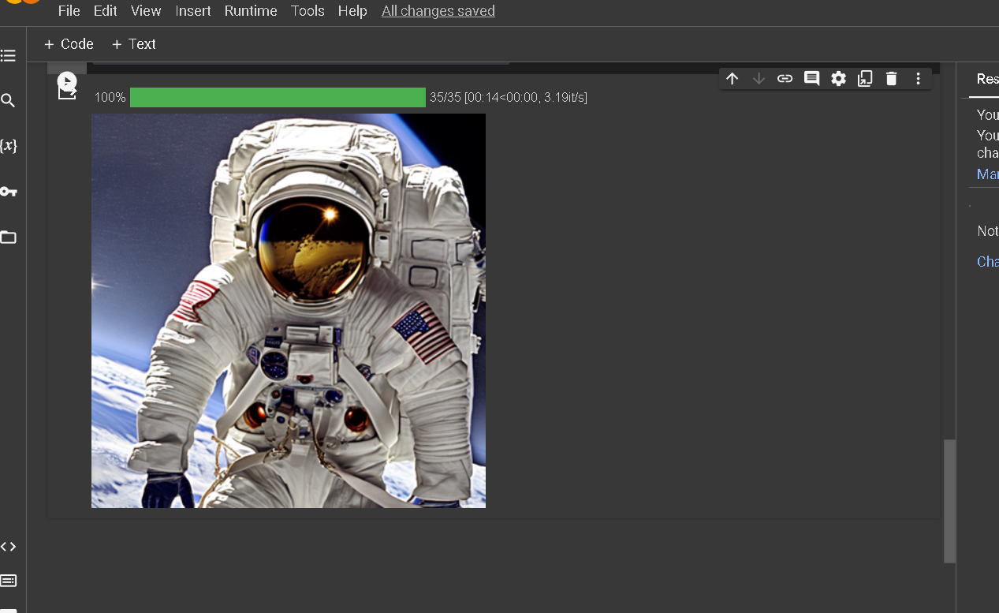

#Output of text to image 

 ## LLM (Large Language Models):
    Large Language Models (LLMs) refer to sophisticated AI models trained on vast amounts of text data to understand, generate, and process human language. 
    They utilize machine learning techniques, often employing deep neural networks, to comprehend context, semantics, and generate coherent human-like text responses.

## LLMA - Index:
    LLMA stands for Large Language Model Application.
    The index related to LLMA refers to the structured repository or system that organizes and facilitates the retrieval of information generated by large language models. 
    This index enhances accessibility and speeds up the retrieval process of text data generated by LLMs.

## Models:
    In the context of AI, models refer to the algorithms or architectures developed to perform specific tasks.
    Large language models, such as GPT (Generative Pre-trained Transformer) models, like GPT-3, GPT-4, etc., are examples of models capable of understanding,         
    processing, and generating human-like text based on the input  data they are trained on.

## Dataset:
    Datasets are collections of structured or unstructured data used for training and testing AI models.
    For LLMs, extensive text datasets are crucial, as they serve as the foundation for training these models, providing them with a broad understanding of language 
    usage and patterns.

## Text Generation:
    Text generation involves the creation of human-like text by AI models. 
    LLMs, leveraging their understanding of language patterns and context from the training data, can produce coherent and contextually relevant text, ranging from sentence completions to full-length articles.

## Text-to-Image Generation:
    Text-to-image generation involves the process of generating visual content based on textual descriptions.
    Some AI models, although primarily focused on language, can be extended to produce images based on descriptive text inputs. 
    These models learn associations between text descriptions and visual elements, allowing them to create images relevant to the provided textual information.

In summary, LLMs represent a significant advancement in natural language processing, utilizing vast datasets and complex models to understand, generate, and organize text data efficiently. Their applications extend beyond text generation to diverse areas, including text-to-image generation, offering a broad spectrum of possibilities for various industries and research domains.

